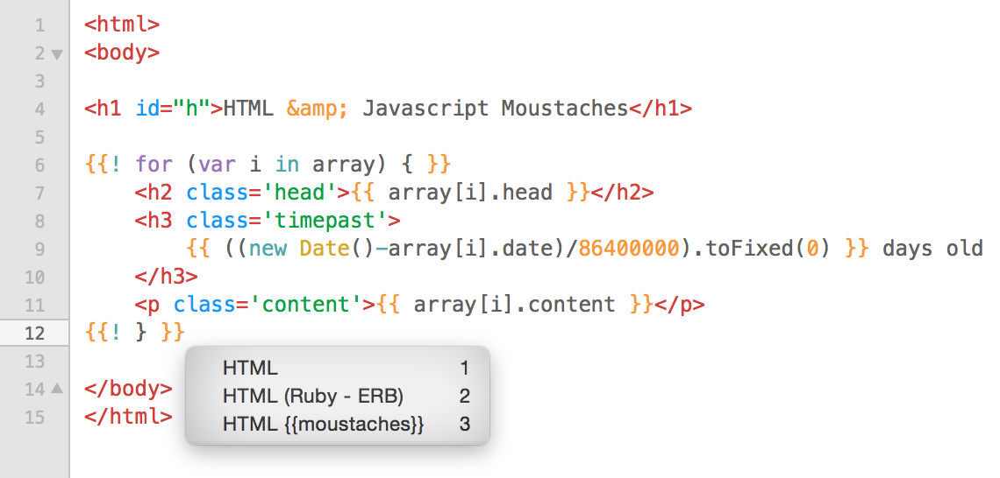

# HTML {{moustaches}}
This TextMate bundle simply adds syntax highlighting for javascript inside html moustaches. Additionally, it provides `for` and `if` statement snippets (try typing either, then hit tab!).

Here's an example:

Works very well with my other project, [jstemplate](http://github.com/lukedmor/jstemplate)!

###Installation:
+ download the ZIP repository, rename the folder removing '-master', and use the .tmbundle extension